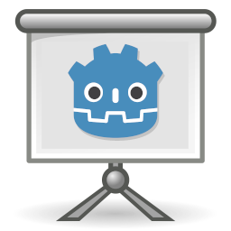

# Presentation.Go!

Simple presentation template created with Godot.

Copyright (c) 2022 Rafa Laguna, released under the GPL license.

Twitter: [@rafalagoon](https://twitter.com/rafalagoon)
Twitch: [https://twitch.tv/rafalagoon](https://twitch.tv/rafalagoon)
Youtube: [https://youtube.com/rafalagoon](https://youtube.com/rafalagoon)

## Documentation

** WIP **
[Presentation.Go! Documentation](doc/index.md)

## License

This program is free software: you can redistribute it and/or modify it under the terms of the **GNU General Public License** (GPL) as published by the Free Software Foundation, either version 3 of the License, or (at your option) any later version.

This program is distributed in the hope that it will be useful, but WITHOUT ANY WARRANTY; without even the implied warranty of MERCHANTABILITY or FITNESS FOR A PARTICULAR PURPOSE. See the GNU General Public License for more details.

You should have received a copy of the GNU General Public License along with this program. If not, see <https://www.gnu.org/licenses/>. 

[GNU General Public License v3.0](doc/gnu-gpl-v3.0.md)
